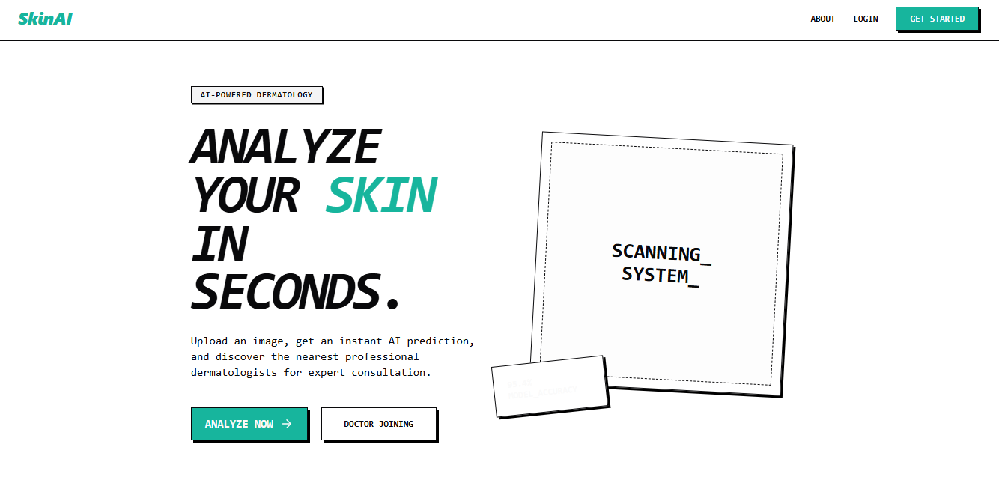

# 🩺 SkinHealth AI — AI-Powered Skin Diagnosis & Clinic Management

 <!-- Replace with your actual banner -->

**SkinHealth AI** is a comprehensive, end-to-end platform that leverages cutting-edge deep learning to predict and analyze skin conditions from uploaded images. Beyond its powerful prediction engine, it serves as a full-fledged clinic management system complete with specialized portals for Patients, Doctors, and Administrators.

---

## ✨ Features

### 🧠 Machine Learning Engine
- **Accurate Diagnosis**: Classifies 9 different classes of skin lesions, including Melanoma, Basal Cell Carcinoma, and Nevus.
- **Deep Learning Architecture**: Built on PyTorch and `timm` (PyTorch Image Models) with robust data augmentation (`albumentations`).
- **Real-Time Inference**: FastAPI-powered inference engine delivering immediate analysis and customized recommendations based on condition severity.

### 🌐 Patient Portal
- **Dashboard**: Track previous predictions, upcoming appointments, and medical history.
- **Image Upload & Analysis**: Securely upload skin images for instant AI assessment.
- **Book Appointments**: Browse doctors, view their schedules, and seamlessly book consultations.

### 👨‍⚕️ Doctor Portal
- **Appointment Management**: Accept, reject, or manage daily schedules.
- **Patient History**: Access detailed historical diagnoses and AI prediction reports for assigned patients.
- **Clinic Settings**: Manage availability, specialization, and consultation fees.

### ⚙️ Admin Dashboard
- **Platform Analytics**: Monitor platform-wide metrics (appointments, users, predictions).
- **User Management**: Oversee patient and doctor onboarding.

---

## 🛠️ Technology Stack

| Category | Technologies Used |
|---|---|
| **Frontend** | React 19, Vite, Tailwind CSS v4, Recharts, Lucide React, Axios |
| **Backend** | FastAPI, Uvicorn, Python-Jose (JWT), Passlib (Bcrypt) |
| **Database** | MongoDB (Motor Async Driver, PyMongo) |
| **Machine Learning** | PyTorch, Torchvision, Scikit-Learn, OpenCV, Albumentations, Pandas |

---

## 🚀 Getting Started

### 1. Prerequisites
Ensure you have the following installed:
- **Python** (v3.10+)
- **Node.js** (v18+)
- **MongoDB** (Local or Atlas URL)

### 2. Backend & ML Setup

Clone the repository and set up the Python environment:
```bash
git clone https://github.com/syedaftab-dev/Skin-health-AI.git
cd Skin-health-AI

# Create a virtual environment
python -m venv venv
source venv/bin/activate  # On Windows use `venv\Scripts\activate`

# Install dependencies
pip install -r requirements.txt
```

Create a `.env` file in the root directory for your database and JWT secret:
```env
MONGODB_URL=mongodb://localhost:27017/skinhealth
SECRET_KEY=your_super_secret_jwt_key
ALGORITHM=HS256
ACCESS_TOKEN_EXPIRE_MINUTES=30
```

Start the FastAPI backend:
```bash
uvicorn api.main:app --reload
```
The API will be available at `http://localhost:8000`.

### 3. Frontend Setup

Open a new terminal window and navigate to the frontend directory:
```bash
cd frontend

# Install dependencies
npm install

# Start the Vite development server
npm run dev
```
The application will be accessible at `http://localhost:5173`.

---

## 🧠 Model Training & Prediction Scripts

If you want to train the model from scratch or run batch predictions via the CLI, use the included Python scripts in the `src/` directory.

### Dataset Structure
Ensure your dataset is organized inside `data/raw/` before training:
```text
data/
  raw/
    Train/
      actinic keratosis/
      basal cell carcinoma/
      ...
    Test/
      ...
```

### Supported Classes & Severity
| Condition | Severity |
|---|---|
| Actinic Keratosis | Medium |
| Basal Cell Carcinoma | High |
| Dermatofibroma | Low |
| Melanoma | High |
| Nevus | Low |
| Pigmented Benign Keratosis | Low |
| Seborrheic Keratosis | Low |
| Squamous Cell Carcinoma | High |
| Vascular Lesion | Medium |

### Training
```bash
python -m src.train
```

### CLI Prediction
```bash
python -m src.predict --image path/to/skin_lesion.jpg
```

---

## 📂 Project Structure

```text
Skin-health-AI/
├── api/                   # FastAPI Backend
│   ├── auth/              # Authentication & JWT logic
│   ├── routers/           # API endpoints (admin, doctors, patients, predictions)
│   ├── database.py        # MongoDB connection setup
│   └── main.py            # FastAPI application entry point
├── frontend/              # React + Vite Frontend
│   ├── src/
│   │   ├── components/    # Reusable UI components
│   │   ├── pages/         # Role-specific pages (Admin, Doctor, Patient)
│   │   └── context/       # React Context (Auth State)
├── src/                   # Machine Learning Source Code
│   ├── dataset.py         # PyTorch Dataset & Augmentations
│   ├── model.py           # Model Architecture
│   ├── train.py           # Training loop
│   └── predict.py         # Inference script
├── models/                # Saved ML model weights
├── requirements.txt       # Python dependencies
└── README.md
```

---

## 🛡️ Disclaimer

> **Important**: This software is for **informational and educational purposes only**. The AI predictions and recommendations are **not a substitute for professional medical advice, diagnosis, or treatment**. Always seek the advice of a qualified healthcare provider or dermatologist with any questions regarding a medical condition.

---

## 🤝 Contributing

Contributions, issues, and feature requests are welcome! 
1. Fork the project.
2. Create your feature branch (`git checkout -b feature/AmazingFeature`).
3. Commit your changes (`git commit -m 'Add some AmazingFeature'`).
4. Push to the branch (`git push origin feature/AmazingFeature`).
5. Open a Pull Request.

## 📝 License

This project is licensed under the MIT License - see the LICENSE file for details.
