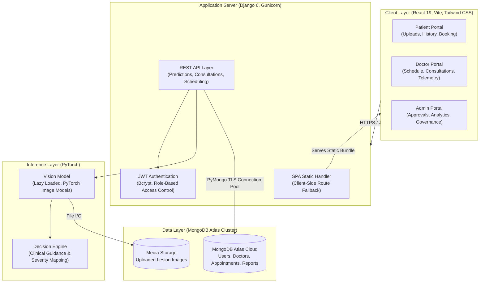

# SkinHealth AI — Dermatological Diagnosis and Clinic Management Platform

[](https://skin-health-ai-r52f.onrender.com/)
[](https://www.djangoproject.com/)
[](https://react.dev/)
[](https://pytorch.org/)
[](https://www.mongodb.com/)
[](https://tailwindcss.com/)

---

### Deployment Status

* **Live URL:** [https://skin-health-ai-r52f.onrender.com/](https://skin-health-ai-r52f.onrender.com/)
* **Platform:** Render (Unified single-instance deployment: React SPA + Django REST API + MongoDB Atlas)
* **Status:** Operational

#### Test Credentials

| Role | Email | Password | Scope |
|---|---|---|---|
| **Patient** | `patient@skinai.com` | `password123` | Lesion image upload, AI prediction history, appointment scheduling |
| **Doctor** | `doctor@skinai.com` | `password123` | Appointment queue, weekly schedule configuration, clinical notes |
| **Administrator** | `admin@skinai.com` | `admin123` | Platform analytics, physician credential approvals, account governance |

---

## Overview

SkinHealth AI is an end-to-end medical software platform integrating deep learning-based skin condition classification with comprehensive clinic workflow management.

The platform provides automated triage and diagnostic insights from dermoscopic and clinical images, mapping conditions to severity tiers and actionable care steps. It pairs this capability with a multi-portal practice management system connecting patients, verified dermatologists, and administrators.

---

## System Architecture


```mermaid
graph TD
    subgraph Client ["Client Layer (React 19, Vite, Tailwind CSS)"]
        UI_P["Patient Portal<br/>(Uploads, History, Booking)"]
        UI_D["Doctor Portal<br/>(Schedule, Consultations, Telemetry)"]
        UI_A["Admin Portal<br/>(Approvals, Analytics, Governance)"]
    end

    subgraph Server ["Application Server (Django 6, Gunicorn)"]
        SPA["SPA Static Handler<br/>(Client-Side Route Fallback)"]
        AUTH["JWT Authentication<br/>(Bcrypt, Role-Based Access Control)"]
        ROUTER["REST API Layer<br/>(Predictions, Consultations, Scheduling)"]
    end

    subgraph Intelligence ["Inference Layer (PyTorch)"]
        PREDICT["Vision Model<br/>(Lazy Loaded, PyTorch Image Models)"]
        RECOMMEND["Decision Engine<br/>(Clinical Guidance & Severity Mapping)"]
    end

    subgraph Data ["Data Layer (MongoDB Atlas Cluster)"]
        MONGO[("MongoDB Atlas Cloud<br/>Users, Doctors, Appointments, Reports")]
        MEDIA[("Media Storage<br/>Uploaded Lesion Images")]
    end

    Client -->|HTTPS / JSON| Server
    SPA -->|Serves Static Bundle| Client
    ROUTER --> AUTH
    ROUTER --> PREDICT
    PREDICT --> RECOMMEND
    ROUTER -->|PyMongo TLS Connection Pool| MONGO
    PREDICT -->|File I/O| MEDIA
```

---

## Diagnostic Engine

The model classifies uploaded skin lesions across **9 distinct diagnostic categories**:

| Index | Condition | Pathology Category | Clinical Severity |
|:---:|---|---|:---:|
| 1 | Actinic Keratosis | Pre-malignant keratinocytic lesion | Medium |
| 2 | Basal Cell Carcinoma | Non-melanocytic skin malignancy | High |
| 3 | Dermatofibroma | Benign dermal dendritic histiocytoma | Low |
| 4 | Melanoma | Malignant melanocytic neoplasm | High (Immediate Attention) |
| 5 | Nevus | Benign melanocytic proliferation | Low |
| 6 | Pigmented Benign Keratosis | Benign seborrheic / solar lentigo | Low |
| 7 | Seborrheic Keratosis | Benign epidermal neoplasm | Low |
| 8 | Squamous Cell Carcinoma | Invasive keratinizing carcinoma | High |
| 9 | Vascular Lesion | Benign or reactive vascular proliferation | Medium |

### Model Outputs

For each evaluation, the inference pipeline returns:
* **Primary Diagnosis**: Common condition name and formal medical terminology.
* **Confidence Metrics**: Percentage probability and complete class distribution breakdown.
* **Severity Grading**: Assigned risk tier (`Low`, `Medium`, `High`).
* **Clinical Protocol**: Guidance on urgent action items, OTC considerations, and medical consultation urgency flags.

---

## Functional Modules

### Patient Interface
* **Lesion Analysis**: Multi-format image submission with real-time inference feedback.
* **Specialist Discovery**: Directory search filtered by geographic pincode, clinic name, and medical specialty.
* **Automated Slot Booking**: Dynamic scheduling engine presenting available 30-minute intervals within a 7-day rolling window.
* **Medical Timeline**: Consolidated chronological history containing both AI diagnostic reports and physician consultation summaries.

### Physician Interface
* **Dynamic Availability Configuration**: Customizable weekly recurring schedule with automated interval computation.
* **Slot Suspension**: Selective date and time blocking for leaves and scheduled downtime.
* **Electronic Consultation Records**: Interface to record diagnostic notes, write prescriptions, and close patient visits.
* **Practice Dashboard**: Real-time caseload summary displaying daily visits, pending cases, and historical patient reach.

### Administrative Interface
* **Physician Onboarding**: Review and approval pipeline verifying medical license credentials and clinic documentation.
* **System Telemetry**: Platform-wide metrics for appointments, registered accounts, and analysis requests.
* **Account Moderation**: User account activation and restriction controls.

---

## Technical Specifications

| Component | Stack | Functionality |
|---|---|---|
| **Frontend Framework** | React 19, Vite | Single-page client interface |
| **Styling** | Tailwind CSS v4 | Responsive medical UI design |
| **Data Visualization** | Recharts, Lucide React | Practice metrics and user telemetry |
| **Application Server** | Django 6, Gunicorn | API service and static asset host |
| **Authentication** | JWT (`python-jose`), `bcrypt` | Stateless token authentication |
| **Database** | MongoDB Atlas (`pymongo`) | Document persistence with TLS pooling |
| **Computer Vision** | PyTorch, `timm`, Albumentations | Lesion classification neural network |
| **Deployment** | Render Web Service | Unified production host (`build.sh`, `render.yaml`) |

---

## Local Development Setup

### Prerequisites
* Python 3.10 or higher
* Node.js 18 or higher with npm
* MongoDB Atlas cluster connection string or local MongoDB instance

### 1. Repository Setup

```bash
git clone https://github.com/syedaftab-dev/Skin-health-AI.git
cd Skin-health-AI
```

### 2. Environment Configuration

Create a `.env` file in the project root:

```env
MONGODB_URI=mongodb+srv://<username>:<password>@cluster0.sjst1ka.mongodb.net/?appName=Cluster0
DB_NAME=skinai
DJANGO_SECRET_KEY=your-django-secret-key
JWT_SECRET=your-jwt-secret-key
JWT_ALGORITHM=HS256
JWT_EXPIRY_MINUTES=1440
DEBUG=True
```

### 3. Backend Execution

```bash
# Initialize Python virtual environment
python -m venv venv
source venv/bin/activate       # Windows: venv\Scripts\activate

# Install dependencies
pip install -r requirements.txt

# Run migrations and launch development server
python manage.py migrate
python manage.py runserver 0.0.0.0:8000
```

The Django API and admin service will be available at `http://localhost:8000`.

### 4. Frontend Execution

In a separate terminal window:

```bash
cd frontend
npm install
npm run dev
```

The Vite development server will be available at `http://localhost:5173`.


## API Specification

| Route | HTTP | Access | Purpose |
|---|:---:|:---:|---|
| `/health` | `GET` | Public | System status check |
| `/api/auth/register/patient` | `POST` | Public | Register patient account |
| `/api/auth/register/doctor` | `POST` | Public | Register physician account |
| `/api/auth/login` | `POST` | Public | Authenticate user and issue JWT |
| `/api/predict/upload` | `POST` | Patient | Submit lesion image for analysis |
| `/api/predictions` | `GET` | Patient | List user prediction records |
| `/api/doctors` | `GET` | Public | Search and list verified physicians |
| `/api/doctors/{id}/availability` | `GET` | Public | Retrieve 7-day appointment availability |
| `/api/appointments` | `POST` | Patient | Reserve appointment slot |
| `/api/appointments/{id}/consultation` | `POST` | Doctor | Submit clinical consultation details |
| `/api/admin/stats` | `GET` | Admin | Retrieve platform telemetry |
| `/api/admin/doctors/{id}/approve` | `PUT` | Admin | Authorize pending physician |

---

## Medical Disclaimer

SkinHealth AI is intended for educational, informational, and research purposes only. The software and machine learning models do not provide professional medical advice, clinical diagnosis, or therapeutic recommendations. Patients should consult a board-certified dermatologist or healthcare professional for evaluation of skin lesions or other medical conditions.

---

